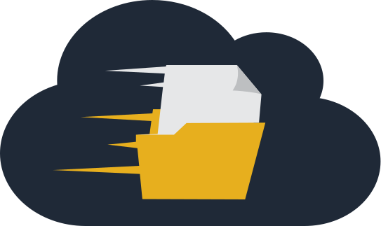

<p align="center">
  <br>
</p>

# gofile-dav - a WebDAV implementation for the gofile.io service

[](https://github.com/synthlace/gofile-dav/actions) [](https://crates.io/crates/gofile-dav)  [](https://github.com/synthlace/gofile-dav/stargazers) [](https://github.com/synthlace/gofile-dav/releases) [](https://github.com/synthlace/gofile-dav)

**gofile-dav** is a minimal, cross‑platform CLI utility that exposes gofile.io directories through WebDAV — ideal for mounting, automation, and scripting.

It supports access either directly through a browser (WebDAV HTTP mode) or via a native WebDAV client.

**Currently, the implementation is read-only.**

**It does not require a premium account** and works seamlessly with free or guest plans, making it accessible for anyone to serve and mount their gofile.io directories (unlike other tools, such as Rclone, which enforce purchasing a premium).

A **quota bypass** is available to help with download limits for free/guest users — [Experimental](#experimental)

## How to use

### Serve a folder using short id using guest account

    gofile-dav serve Veil7n

### Serve a folder using long id using guest account

    gofile-dav serve 6c9e22a7-7d6c-4986-8e93-b118558be0bb

### Serve your root folder

    gofile-dav serve --api-token Maie2RlOFDDDRao0Y5ll54EAtv2imUlZ

### Serve specific folder with your token

    gofile-dav serve Veil7n --api-token Maie2RlOFDDDRao0Y5ll54EAtv2imUlZ

### Upgrade

    gofile-dav upgrade

## Experimental

**gofile-dav implements bypass mechanism that uses [gofile-bypass.cybar.xyz](https://gofile-bypass.cybar.xyz/) public service. Which can help with download quota limits for free/guest users.**

### Serve specific folder with bypass using guest account

    gofile-dav serve Veil7n --bypass

### Serve your root folder with bypass

**Warning:** To use the bypass on your own folder you must make the folder public!

    gofile-dav serve --bypass --api-token Maie2RlOFDDDRao0Y5ll54EAtv2imUlZ

## Usage

### `gofile-dav`

```text
a WebDAV implementation for the gofile.io service

Usage: gofile-dav <COMMAND>

Commands:
  serve    Run webdav server
  upgrade  Upgrade the binary
  help     Print this message or the help of the given subcommand(s)

Options:
  -h, --help     Print help
  -V, --version  Print version
```

### `gofile-dav serve`

```text
Run webdav server

Usage: gofile-dav serve [OPTIONS] <ROOT_ID|--api-token <API_TOKEN>>

Arguments:
  [ROOT_ID]  Root folder ID [env: ROOT_ID=]

Options:
  -t, --api-token <API_TOKEN>  Gofile API token [env: API_TOKEN=]
  -p, --port <PORT>            Port for the application [env: PORT=] [default: 4914]
      --host <HOST>            Host for the application [env: HOST=] [default: 127.0.0.1]
  -b, --bypass                 Use public service gofile-bypass.cybar.xyz for downloads [env: BYPASS=]
  -h, --help                   Print help
  -V, --version                Print version
```
